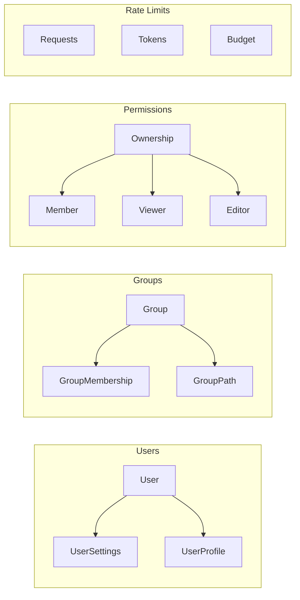
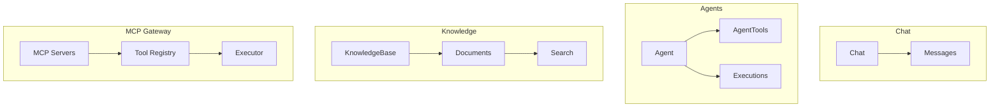
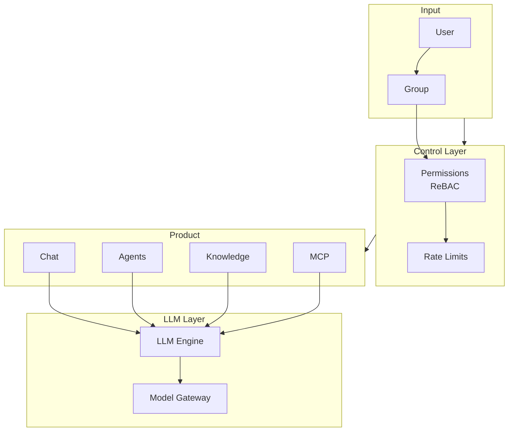
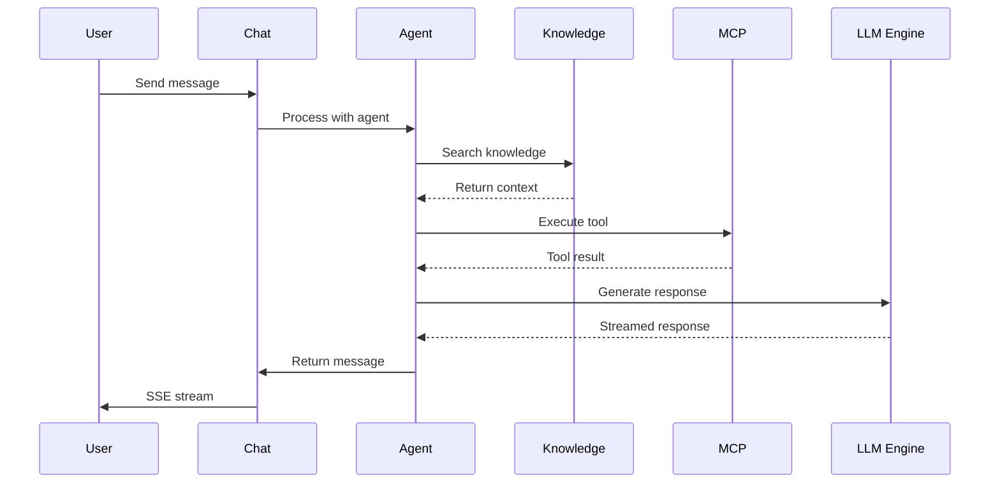
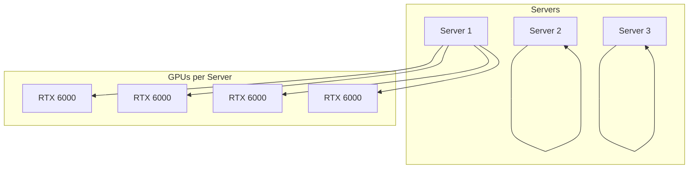

# Domain Model - LLM Platform

## Overview

```mermaid
%%{init: {'theme': 'dark', 'themeVariables': { 'primaryColor': '#3b82f6', 'secondaryColor': '#8b5cf6', 'tertiaryColor': '#10b981'}}}%%

graph TB
    subgraph CORE["CORE DOMAINS"]
        US[Users]
        GR[Groups]
        PR[Permissions]
        RL[Rate Limits]
    end

    subgraph PRODUCT["PRODUCT DOMAINS"]
        CH[Chat]
        AG[Agents]
        KB[Knowledge]
        MC[MCP Gateway]
        HL[HITL]
    end

    subgraph INFRA["INFRASTRUCTURE"]
        LE[LLM Engine]
        MG[Model Gateway]
    end

    US --- PR
    GR --- PR
    PR --- RL
    CH --- PR
    AG --- PR
    KB --- PR
    MC --- PR
    HL --- PR

    CH --> AG
    AG --> HL
    HL --> AG
    AG --> LE
    KB --> LE
    MC --> AG
    MC --> LE
    LE --> MG

    style CORE fill:#1e293b,stroke:#3b82f6
    style PRODUCT fill:#1e293b,stroke:#8b5cf6
    style INFRA fill:#1e293b,stroke:#10b981
```



---

## Domain Architecture

### Core Domains



### Product Domains



---

## Domain Relationships



---

## ReBAC Relationships

```mermaid
graph LR
    subgraph OWNERSHIP["Ownership"]
        O1[chat:X@owner@user:Y]
        O2[agent:X@owner@user:Y]
        O3[kb:X@owner@user:Y]
    end

    subgraph ACCESS["Access Control"]
        A1[chat:X@member@user:Y]
        A2[kb:X@editor@user:Y]
        A3[kb:X@viewer@group:Y]
    end

    subgraph HIERARCHY["Group Hierarchy"]
        H1[group:X@parent@group:Y]
        H2[group:Y@parent@group:Z]
    end
```

---

## Data Flow



---

## Infrastructure



---

## Domain 5: MCP Gateway (with Tool Permissions)

### 5.1 MCP Servers

User-configurable MCP servers с **tool-level permissions**:
- Name, description
- Endpoint URL
- Auth type (none, API key, OAuth)
- Auth credentials (encrypted)

### 5.2 Tool Registry

Tool types:
- MCP tools (from connected servers)
- Function tools (built-in)
- HTTP tools (external APIs)

### 5.3 MCP Executor

- JSON-RPC 2.0 based
- Tool call handling
- Result streaming

---

## Domain 6: HITL (Human-in-the-Loop)

### 6.1 HITL Types

| Type | Description |
|------|-------------|
| Tool Execution | Approve dangerous tool calls |
| Response Review | Approve AI generated responses |
| Custom Widgets | Forms for human input |

### 6.2 Integration

- **Chat**: inline approvals in message payload
- **Agentic workflows**: separate endpoints for pause/resume

---

## Domain 7: LLM Engine & Model Gateway

### 7.1 Models

- Chat models, Embedding models, Re-rank models, Vision models
- Providers: Cloud (OpenAI, Anthropic, Groq) + Local (SGLang, vLLM)

### 7.2 Model Dashboard

Metrics like OpenRouter:
- Total Requests, RPS
- Latency (P50, P99)
- Throughput TPM
- Error Rate
- GPU Utilization
- Cost tracking

### 7.3 API Compatibility

| Standard | Endpoints |
|----------|-----------|
| OpenAI | `/v1/chat/completions`, `/v1/responses`, `/v1/embeddings` |
| Anthropic | `/v1/messages` |

### 7.4 Model Gateway

- OpenAI-compatible API
- Multi-GPU support (SGLang/vLLM)
- Health monitoring

**Infrastructure:** 3 servers × 4 RTX 6000 + 2× AMD EPYC (~150GB VRAM)