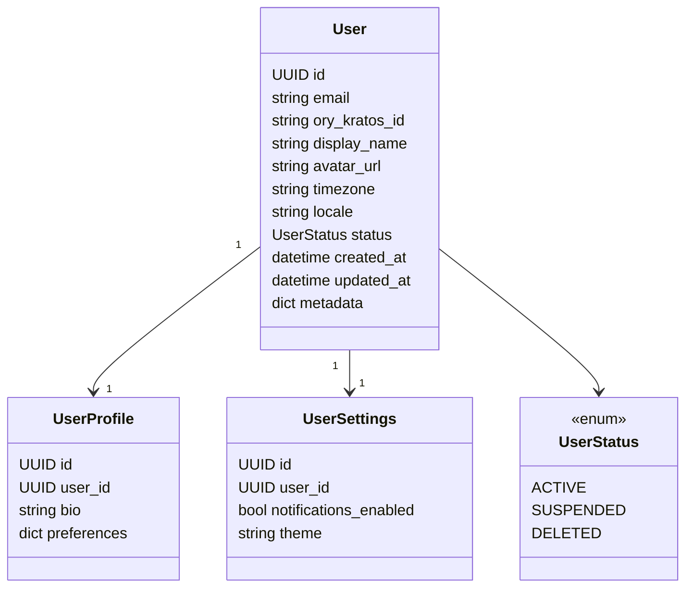

# Domain: Core - Users

## Overview

User management domain - управление пользователями через интеграцию с Ory Kratos.

## Entities



## Integration Flow

```mermaid
sequenceDiagram
    participant U as User
    participant K as Ory Kratos
    participant DB as Database
    participant WH as Webhook

    rect rgb(30, 41, 59)
        note right of U: Registration
        U->>K: POST /self-service/registration
        K->>K: Create identity
        K-->>U: Session token
        WH->>K: Identity created
        WH->>DB: Create User(ory_kratos_id)
    end

    rect rgb(30, 41, 59)
        note right of U: Login
        U->>K: POST /self-service/login
        K-->>U: Session token
        K->>DB: Validate user
    end
```



## API Reference

### REST Endpoints

| Method | Endpoint | Description | Access |
|--------|----------|-------------|--------|
| GET | /api/users/me | Current user profile | Authenticated |
| PATCH | /api/users/me | Update own profile | Authenticated |

> **Note:** User management is handled by Ory Kratos. Admin endpoints not documented here.
```