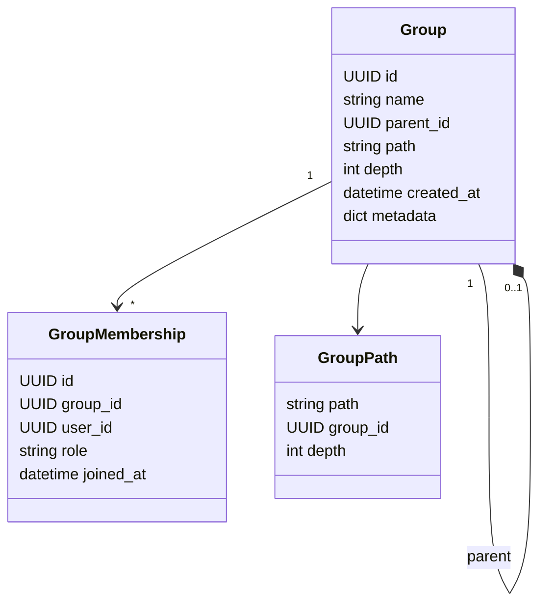
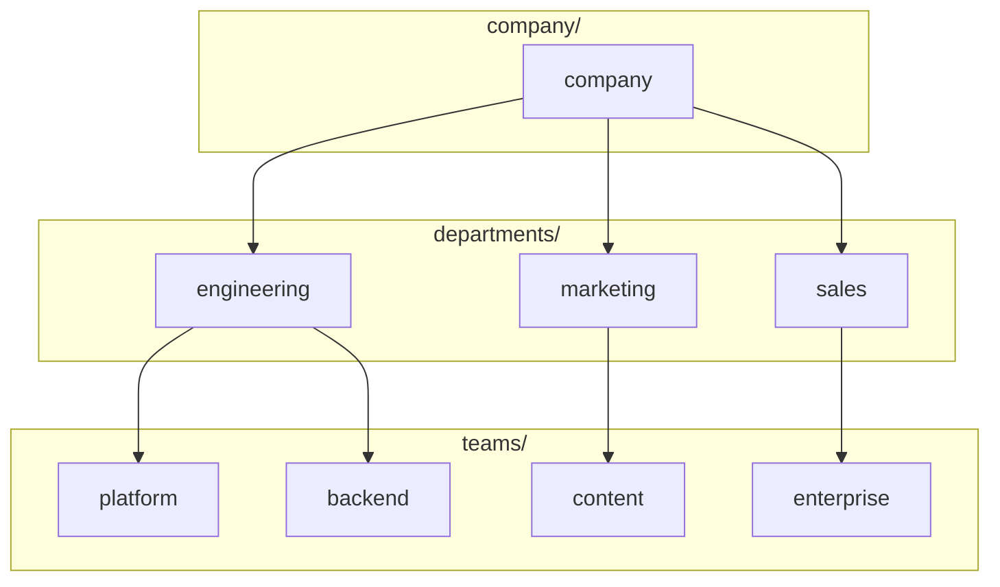

# Domain: Core - Groups

## Overview

Group management domain с иерархической структурой до 5 уровней в depth.

## Entities

## Hierarchy Example

## Validation Rules

- Max depth: 5 levels
- Path format: `/company/department/team/...`
- Unique name at sibling level
- Circular references prohibited

## API Reference

### REST Endpoints

| Method | Endpoint | Description |
|--------|----------|-------------|
| GET | /api/groups | List groups |
| POST | /api/groups | Create group |
| GET | /api/groups/{id} | Get group |
| PATCH | /api/groups/{id} | Update group |
| DELETE | /api/groups/{id} | Delete group |
| GET | /api/groups/{id}/members | List members |
| POST | /api/groups/{id}/members | Add member |
| DELETE | /api/groups/{id}/members/{user_id} | Remove member |