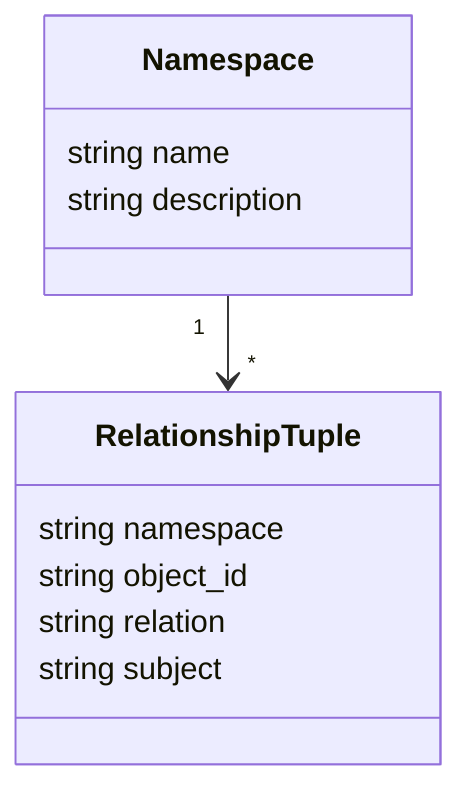
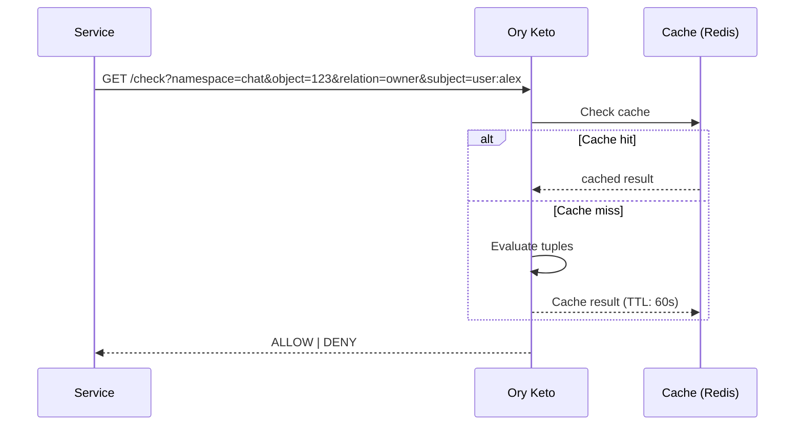
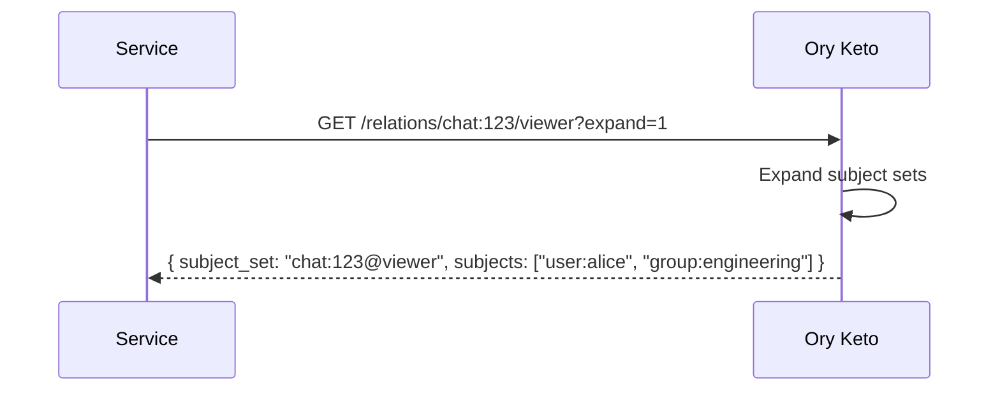

# Domain: Core - Permissions (ReBAC)

## Overview

Relationship-Based Access Control via Ory Keto.

## Relationship Model



## Relationship Types

```mermaid
graph TB
    subgraph OWNERSHIP["Ownership Relations"]
        O1[chat:X@owner@user:Y]
        O2[agent:X@owner@user:Y]
        O3[kb:X@owner@user:Y]
        O4[mcp:X@owner@user:Y]
    end

    subgraph ACCESS["Access Relations"]
        A1[chat:X@member@user:Y]
        A2[kb:X@editor@user:Y]
        A3[kb:X@viewer@user:Y]
        A4[kb:X@viewer@group:Z]
    end

    subgraph EXECUTE["Execute Relations"]
        E1[agent:X@executor@user:Y]
        E2[agent:X@executor@group:Z]
        E3[mcp:X@user@group:Z]
    end

    subgraph HIERARCHY["Group Hierarchy"]
        H1[group:X@parent@group:Y]
        H2[group:X@member@user:Z]
    end
```

## Check API



## Query API (Expand)



## API Reference

### REST Endpoints

| Method | Endpoint | Description |
|--------|----------|-------------|
| POST | /api/permissions/check | Check permission |
| POST | /api/permissions/write | Write relationship |
| DELETE | /api/permissions | Delete relationship |
| GET | /api/permissions/list | List relationships |
| GET | /api/permissions/expand | Expand subject set |

> **Note:** Uses Ory Keto API internally.