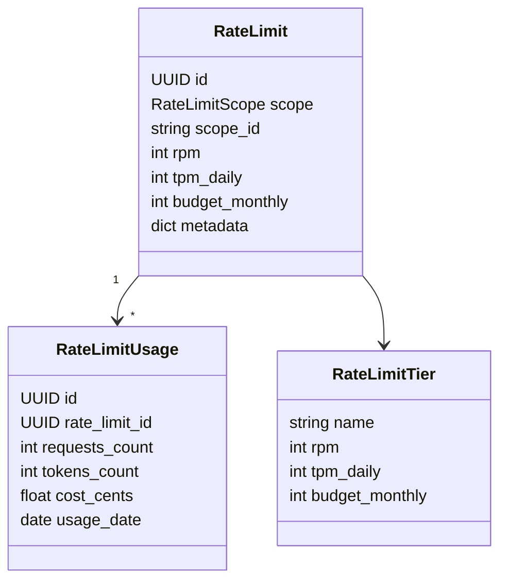
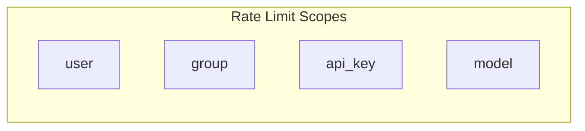
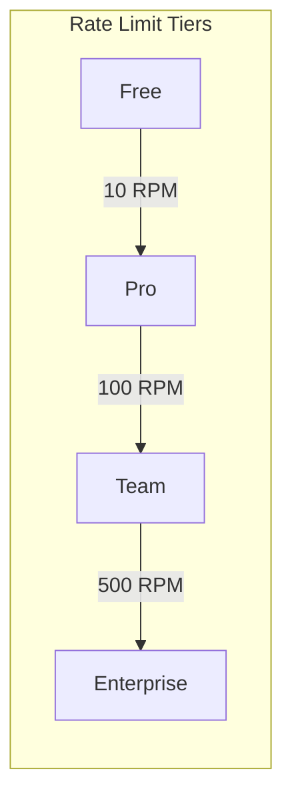
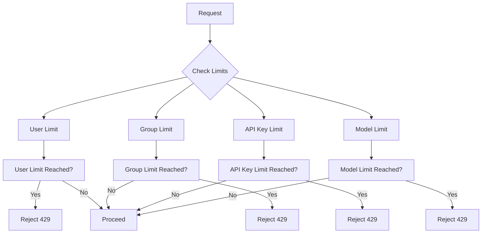
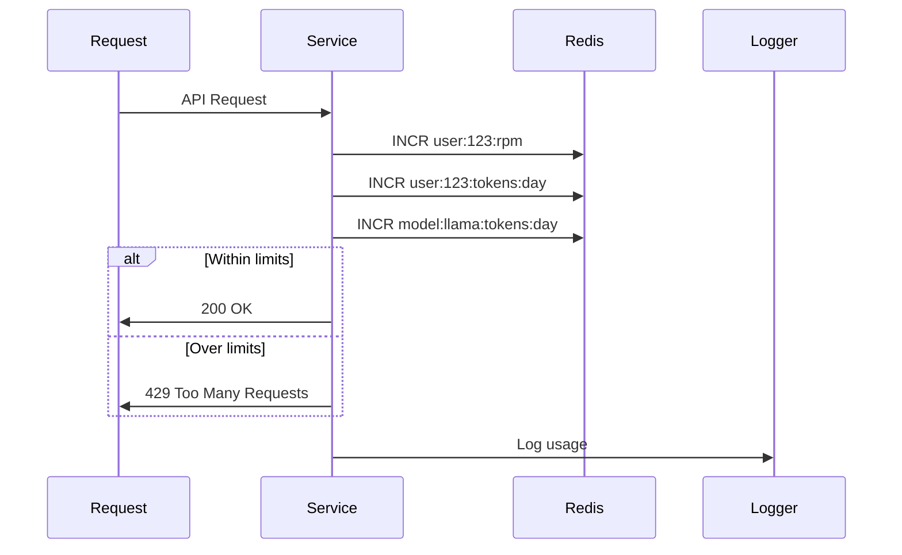

# Domain: Core - Rate Limits

## Overview

Rate limiting system для пользователей, групп, API ключей и моделей.

## Entities



## Scope Types



## Tier Configuration



## Limit Hierarchy



## Counter Implementation



## API Reference

### REST Endpoints

| Method | Endpoint | Description |
|--------|----------|-------------|
| GET | /api/rate-limits | Get my rate limits |
| POST | /api/rate-limits | Set rate limit (admin) |
| GET | /api/rate-limits/usage | Get usage stats |
| POST | /api/rate-limits/reset | Reset limits (admin) |

### Redis Keys Pattern

```
# RPM (sliding window)
ratelimit:user:{user_id}:rpm:{minute}

# TPM Daily
ratelimit:user:{user_id}:tokens:{date}

# Budget Monthly
ratelimit:user:{user_id}:budget:{year_month}
```