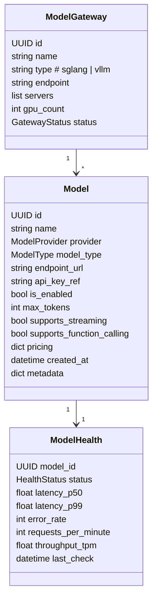
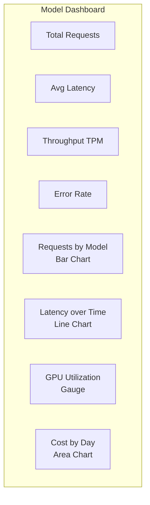
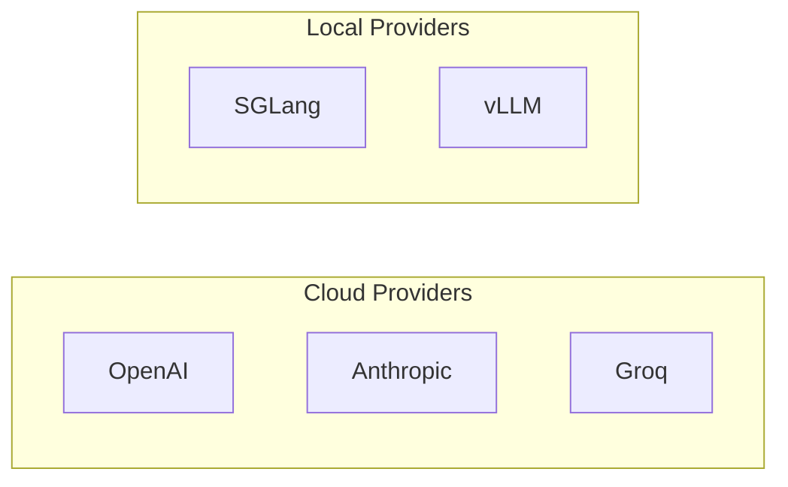
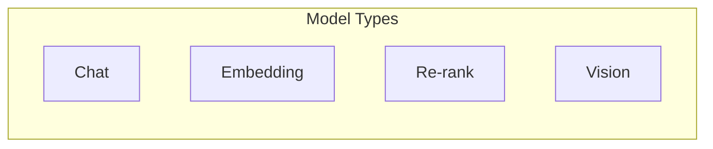
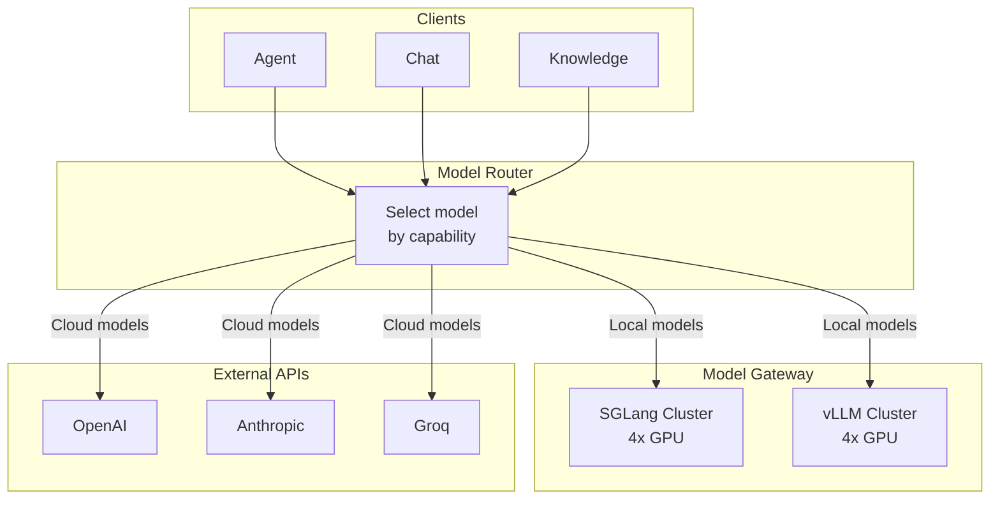
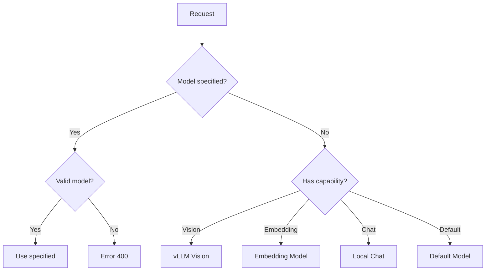
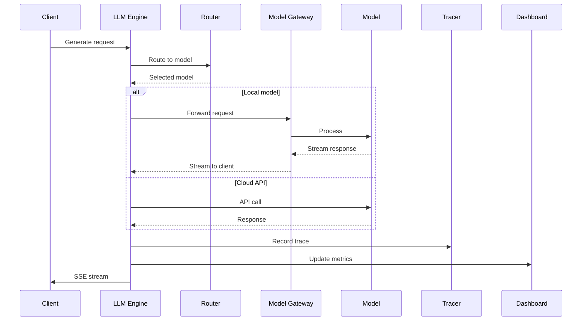
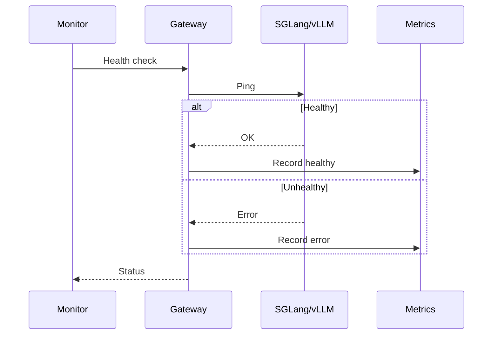
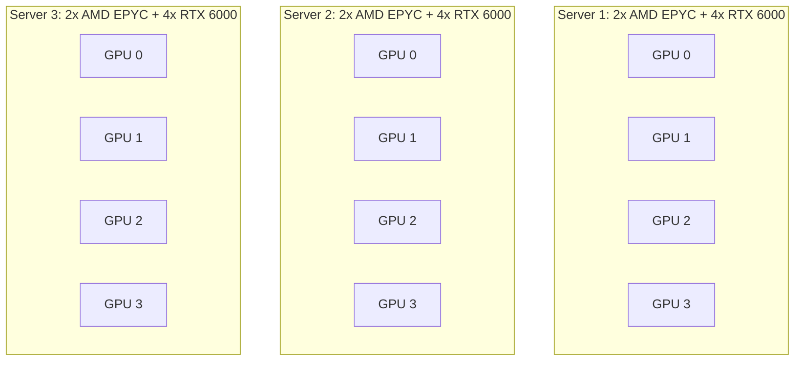

# Domain: LLM Engine & Model Gateway

## Overview

LLM платформа - управление моделями, модельным шлюзом и LLM движком с поддержкой OpenAI и Anthropic совместимых API.

## Entities



## Model Dashboard



**Dashboard Metrics:**

| Metric | Description | Visual |
|--------|-------------|--------|
| Total Requests | All time request count | Number |
| Requests/min | Current RPS | Number + Trend |
| Avg Latency P50 | Median response time | Line chart |
| Avg Latency P99 | P99 response time | Line chart |
| Throughput TPM | Tokens per minute | Gauge |
| Error Rate | % failed requests | Line chart |
| Cost | Total cost (cloud models) | Area chart |
| GPU Util | Local GPU utilization | Gauge per GPU |

## Providers



## Model Types



## OpenAI-Compatible API

### Chat Completions

```mermaid
graph LR
    subgraph ENDPOINTS["Endpoints"]
        CC[/v1/chat/completions]
        RE[/v1/responses]
        EM[/v1/embeddings]
        MO[/v1/models]
    end
```

| Endpoint | Method | Description |
|----------|--------|-------------|
| POST | /v1/chat/completions | Chat completions (OpenAI compatible) |
| POST | /v1/responses | Responses API (OpenAI) |
| POST | /v1/embeddings | Embeddings |
| GET | /v1/models | List available models |
| GET | /v1/models/{model} | Get model info |

### Request Format (OpenAI Compatible)

```json
POST /v1/chat/completions
{
  "model": "gpt-4o",
  "messages": [
    { "role": "system", "content": "You are helpful" },
    { "role": "user", "content": "Hello" }
  ],
  "temperature": 0.7,
  "max_tokens": 1000,
  "stream": true
}
```

### Response Format

```json
{
  "id": "chatcmpl-xxx",
  "object": "chat.completion",
  "created": 1234567890,
  "model": "gpt-4o",
  "choices": [
    {
      "index": 0,
      "message": {
        "role": "assistant",
        "content": "Hello! How can I help?"
      },
      "finish_reason": "stop"
    }
  ],
  "usage": {
    "prompt_tokens": 10,
    "completion_tokens": 20,
    "total_tokens": 30
  }
}
```

## Anthropic-Compatible API

| Endpoint | Method | Description |
|----------|--------|-------------|
| POST | /v1/messages | Anthropic messages API |
| POST | /v1/messages/cancel | Cancel message |

### Request Format (Anthropic Compatible)

```json
POST /v1/messages
{
  "model": "claude-sonnet-4-20250514",
  "messages": [
    { "role": "user", "content": "Hello" }
  ],
  "max_tokens": 1024,
  "stream": true
}
```

### Response Format

```json
{
  "id": "msg_xxx",
  "type": "message",
  "role": "assistant",
  "content": [
    { "type": "text", "text": "Hello!" }
  ],
  "model": "claude-sonnet-4-20250514",
  "stop_reason": "end_turn",
  "usage": {
    "input_tokens": 10,
    "output_tokens": 20
  }
}
```

## Gateway Architecture



## Model Routing Logic



## Inference Pipeline



## Health Monitoring



## API Reference

### Public API (OpenAI Compatible)

| Endpoint | Method | Description |
|----------|--------|-------------|
| POST | /v1/chat/completions | Chat completions |
| POST | /v1/responses | Responses API |
| POST | /v1/embeddings | Embeddings |
| GET | /v1/models | List available models |
| GET | /v1/models/{model} | Get model info |

### Public API (Anthropic Compatible)

| Endpoint | Method | Description |
|----------|--------|-------------|
| POST | /v1/messages | Anthropic messages API |
| POST | /v1/messages/cancel | Cancel message |

### Dashboard (Read-only)

| Method | Endpoint | Description |
|--------|----------|-------------|
| GET | /api/dashboard/models | Models overview |
| GET | /api/dashboard/models/{id}/history | Historical metrics |
| GET | /api/dashboard/gpu | GPU utilization |
| GET | /api/dashboard/costs | Cost tracking |

> **Note:** Model registration/management is internal — available via Admin Panel.

## Infrastructure



**Total Resources:**
- 12x NVIDIA RTX 6000
- 6x AMD EPYC
- ~150GB VRAM