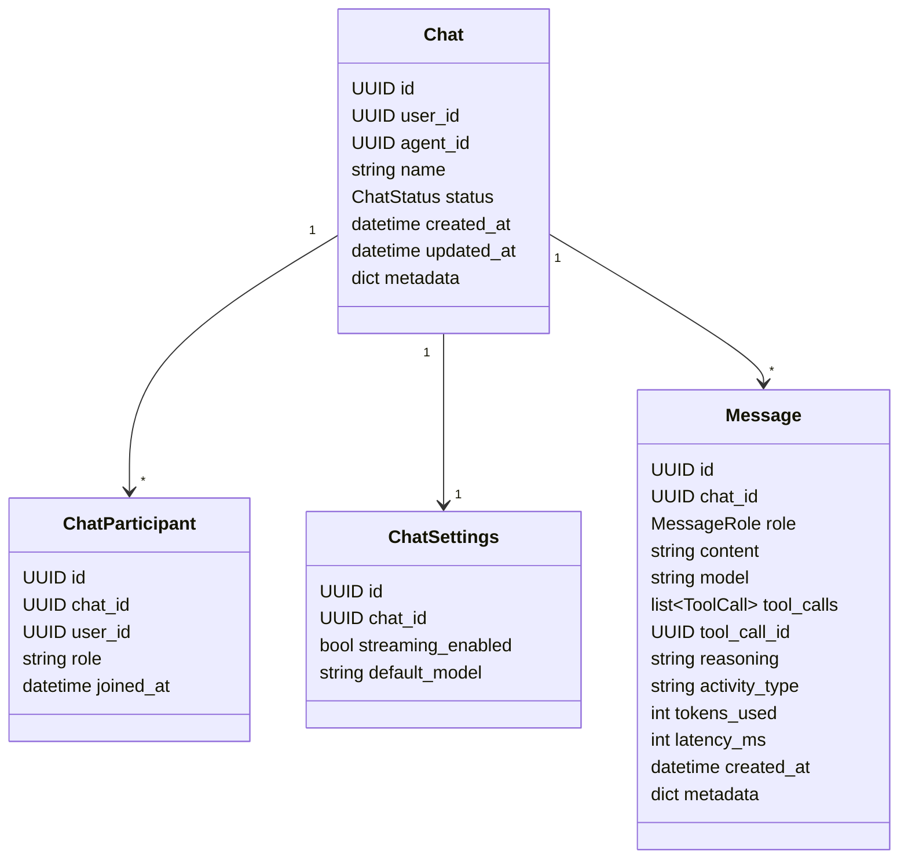
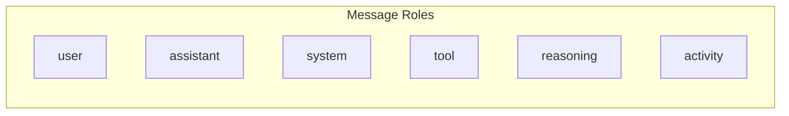
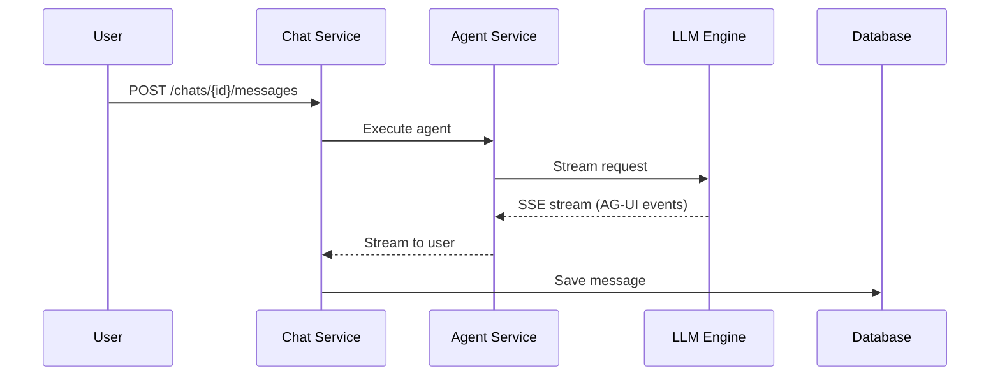
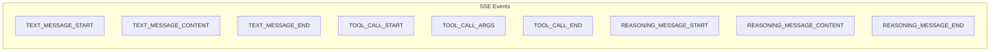

# Domain: Chat

## Overview

Chat domain - управление чатами и сообщениями с поддержкой AG-UI протокола.

## Entities

## Message Roles (AG-UI)

## Chat Flow

## API Reference

### REST Endpoints

| Method | Endpoint | Description |
|--------|----------|-------------|
| GET | /api/chats | List chats |
| POST | /api/chats | Create chat |
| GET | /api/chats/{id} | Get chat |
| PATCH | /api/chats/{id} | Update chat |
| DELETE | /api/chats/{id} | Delete chat |
| GET | /api/chats/{id}/messages | List messages |
| POST | /api/chats/{id}/messages | Send message (SSE) |

## AG-UI Compatibility

### Event Mapping

| Event | Data | Description |
|-------|------|-------------|
| text_message_start | `{messageId, role}` | Start of assistant message |
| text_message_content | `{messageId, delta}` | Text chunk |
| text_message_end | `{messageId}` | End of message |
| tool_call_start | `{toolCallId, toolName}` | Start tool call |
| tool_call_args | `{toolCallId, delta}` | JSON arguments |
| tool_call_end | `{toolCallId}` | End tool call |
| reasoning_message_start | `{messageId}` | Start reasoning |
| reasoning_message_content | `{messageId, delta}` | Reasoning chunk |