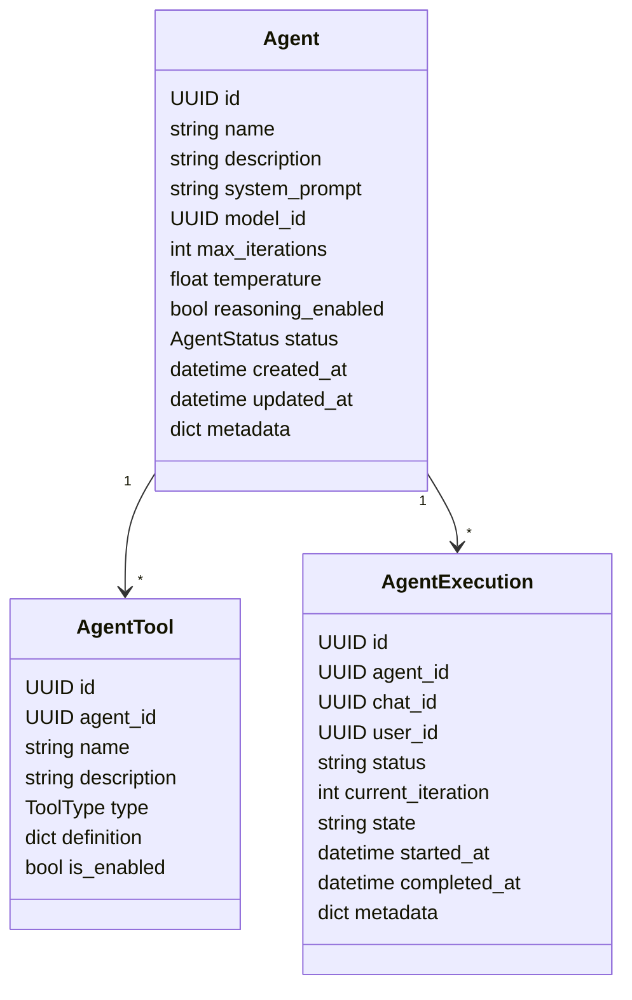
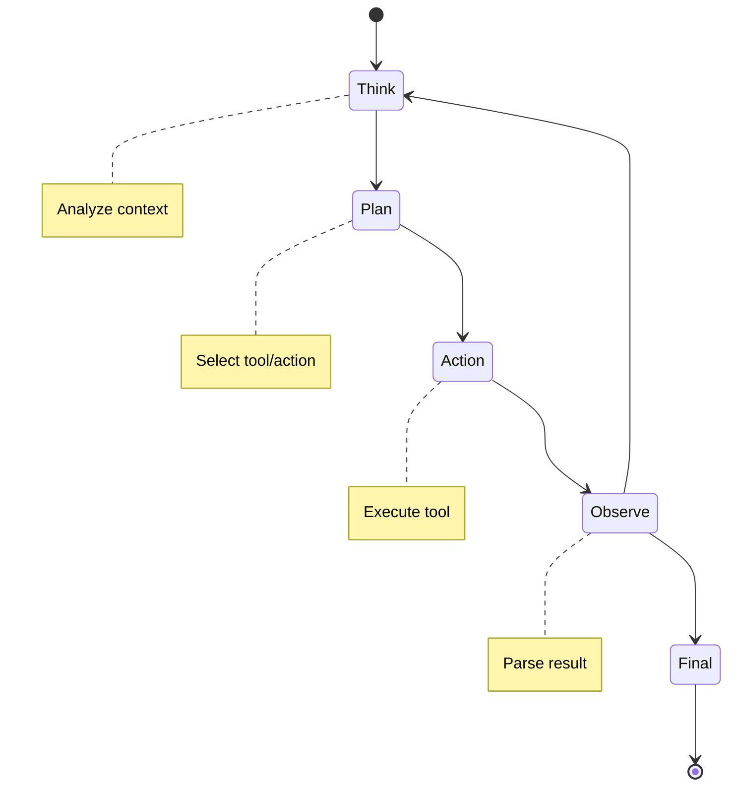
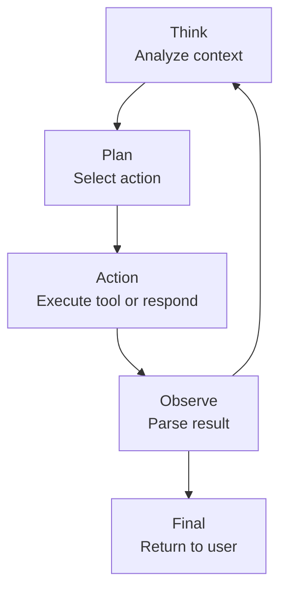
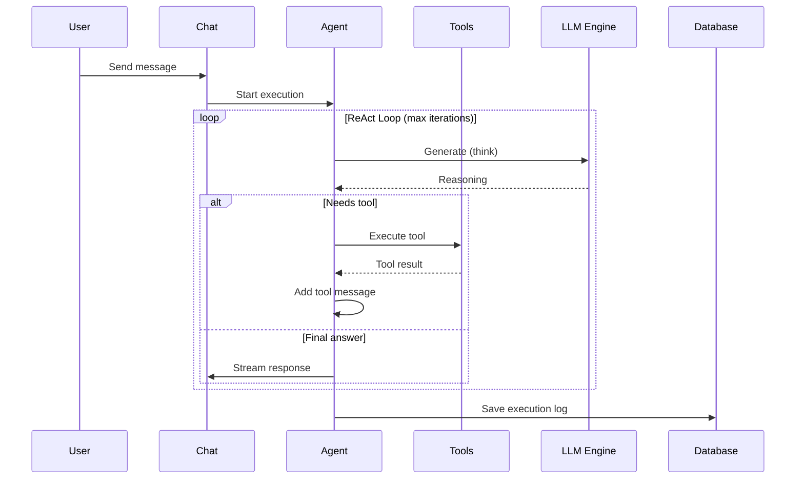
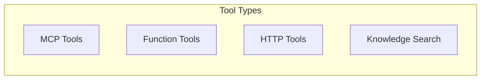

# Domain: Agents

## Overview

AI Agents domain с поддержкой ReAct loop pattern.

## Entities



## ReAct Loop





## Execution Flow



## Tool Types



## API Reference

### REST Endpoints

| Method | Endpoint | Description |
|--------|----------|-------------|
| GET | /api/agents | List agents |
| POST | /api/agents | Create agent |
| GET | /api/agents/{id} | Get agent |
| PATCH | /api/agents/{id} | Update agent |
| DELETE | /api/agents/{id} | Delete agent |
| POST | /api/agents/{id}/execute | Execute agent |
| DELETE | /api/agents/{id}/executions/{exec_id} | Stop execution |

## Reasoning Visibility

```mermaid
graph LR
    subgraph VISIBILITY["Reasoning Options"]
        V1[Visible to user]
        V2[Hidden (internal only)]
        V3[Collapsible]
    end
```

## Iteration Tracking

```mermaid
classDiagram
    class ExecutionStep {
        UUID id
        UUID execution_id
        int iteration
        StepType type
        string thought
        string action
        string observation
        int tokens_used
        int latency_ms
        datetime timestamp
    }

    enum StepType {
        THINK
        PLAN
        ACTION
        OBSERVE
    }
```