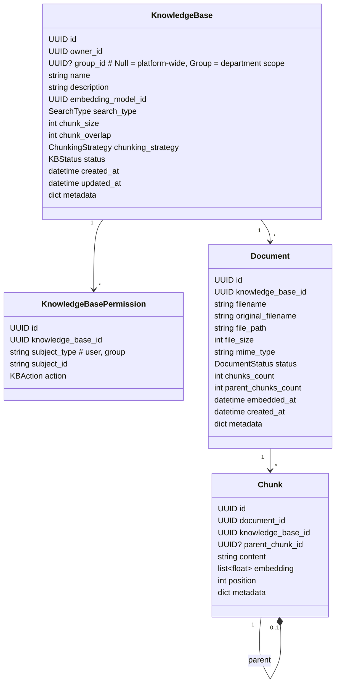
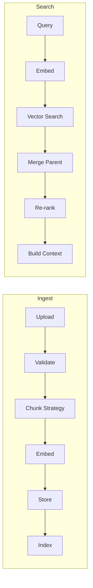
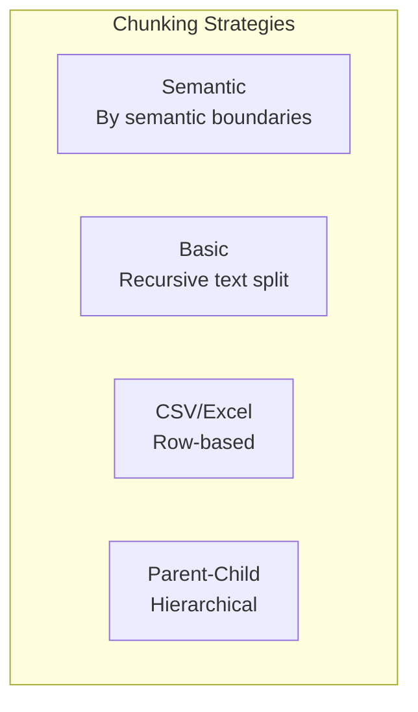
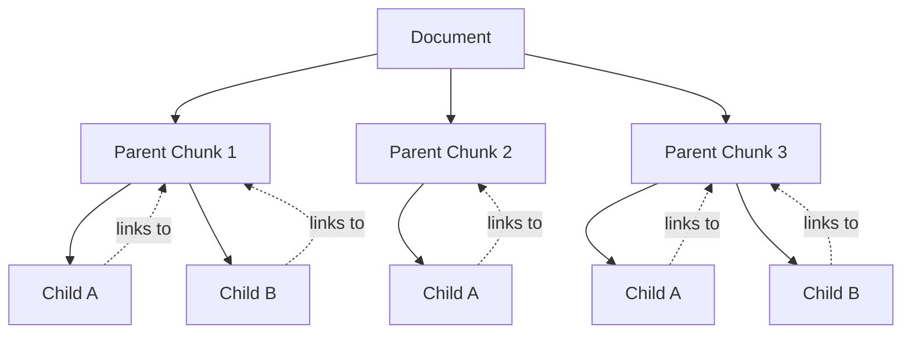
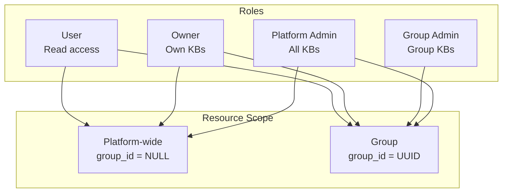
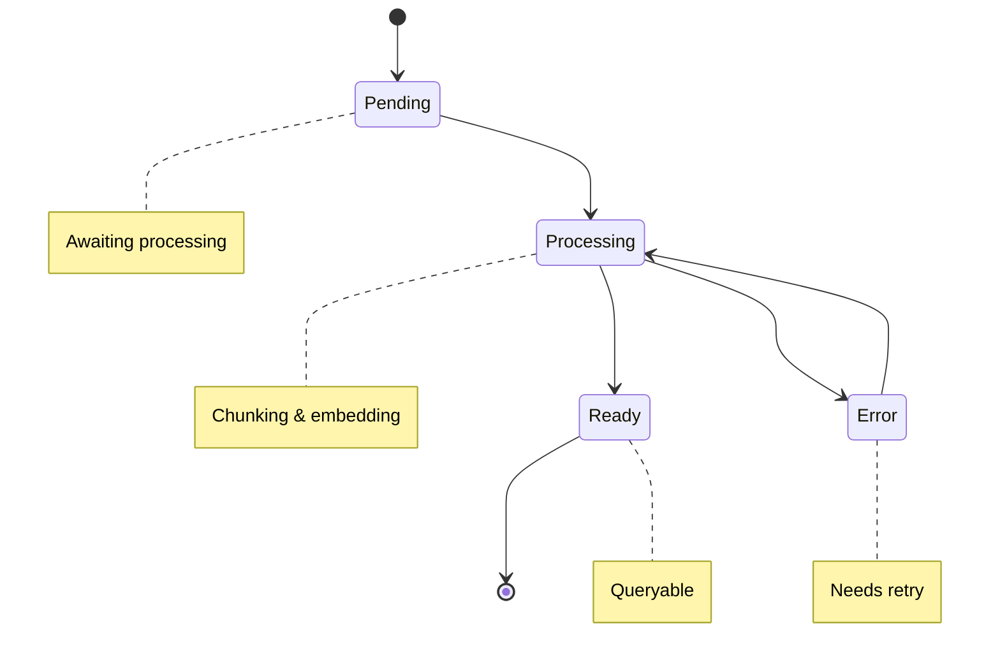
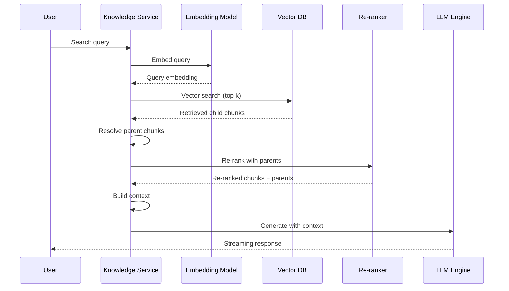

# Domain: Knowledge

## Overview

Knowledge Base domain - управление базами знаний, документами и RAG pipeline.

## Entities



## Processing Pipeline



## Chunking Strategies



### Basic (Recursive)

```python
# Recursive text splitting
# Split by paragraphs -> sentences -> tokens
# Max chunk_size tokens, overlap chunk_overlap tokens
```

### Semantic

```python
# Uses embedding scores to find semantic boundaries
# 1. Split by paragraphs
# 2. Calculate embeddings for each paragraph
# 3. Merge similar paragraphs into chunks
# 4. Ensure chunk_size limit
```

### CSV/Excel

```python
# Row-based with column selection
config:
  columns: ["description", "name"]  # Embed only these
  include_columns: ["id", "sku"]     # Include in context, don't embed
  delimiter: ","
  header: true

# Each row becomes a chunk:
# "id: 001, sku: ABC, description: Product description..."
```

### Parent-Child Chunking



**Workflow:**
1. Split document into parent chunks (large, e.g., 4000 tokens)
2. Split parent into child chunks (small, e.g., 200 tokens)
3. **Embed only children** in vector DB
4. On search: retrieve children → link to parents → include parents in context

## API Reference

### REST Endpoints

#### Knowledge Bases (Admin/Group Admin)

| Method | Endpoint | Description | Access |
|--------|----------|-------------|--------|
| GET | /api/kb | List KBs | Platform/Group Admin, Owner |
| POST | /api/kb | Create KB | Platform/Group Admin, Owner |
| GET | /api/kb/{id} | Get KB | With permission |
| PATCH | /api/kb/{id} | Update KB | Owner, Platform/Group Admin |
| DELETE | /api/kb/{id} | Delete KB | Owner, Platform Admin |

#### KB Permissions (Admin)

| Method | Endpoint | Description | Access |
|--------|----------|-------------|--------|
| GET | /api/kb/{id}/permissions | List permissions | Owner, Platform Admin |
| POST | /api/kb/{id}/permissions | Add permission | Owner, Platform Admin |
| DELETE | /api/kb/{id}/permissions/{perm_id} | Remove permission | Owner, Platform Admin |

#### Documents

| Method | Endpoint | Description | Access |
|--------|----------|-------------|--------|
| GET | /api/kb/{id}/documents | List documents | With read |
| POST | /api/kb/{id}/documents | Upload document | With write |
| GET | /api/kb/{id}/documents/{doc_id} | Get document | With read |
| DELETE | /api/kb/{id}/documents/{doc_id} | Delete document | With write |
| GET | /api/kb/{id}/documents/{doc_id}/preview | Preview | With read |
| GET | /api/kb/{id}/documents/{doc_id}/chunks | Doc chunks | With read |

#### Chunks

| Method | Endpoint | Description | Access |
|--------|----------|-------------|--------|
| GET | /api/kb/{id}/chunks | List all chunks | With read |
| GET | /api/kb/{id}/chunks/{chunk_id} | Get chunk | With read |
| GET | /api/kb/{id}/chunks/{chunk_id}/parent | Get parent | With read |

#### Search (All authenticated)

| Method | Endpoint | Description | Access |
|--------|----------|-------------|--------|
| POST | /api/kb/{id}/search | Search KB | With read |
| POST | /api/kb/{id}/search/stream | Search + stream | With read |

## Configuration Example

```json
{
  "name": "Product Knowledge Base",
  "description": "Product documentation and specs",
  "embedding_model_id": "uuid",
  "search_type": "hybrid",
  "chunk_size": 512,
  "chunk_overlap": 50,
  "chunking_strategy": "parent_child",
  "chunking_config": {
    "strategy": "semantic",
    "parent_chunk_size": 2000,
    "child_chunk_size": 200,
    "csv": {
      "columns": ["description", "name"],
      "include_columns": ["id", "sku"]
    }
  }
}
```

## Permission Model

### Roles & Scope



### Permission Matrix

| Role | Scope | Create | Read | Update | Delete | Search |
|------|-------|--------|------|--------|--------|--------|
| Platform Admin | Platform-wide | ✓ | ✓ | ✓ | ✓ | ✓ |
| Platform Admin | Group | ✓ | ✓ | ✓ | ✓ | ✓ |
| Group Admin | Own Group | ✓ | ✓ | ✓ | ✓ | ✓ |
| Owner | Own KB | ✓ | ✓ | ✓ | ✓ | ✓ |
| User | Any | ✗ | With permission | ✗ | ✗ | ✓* |

*With read permission

## Processing States



## RAG Pipeline

