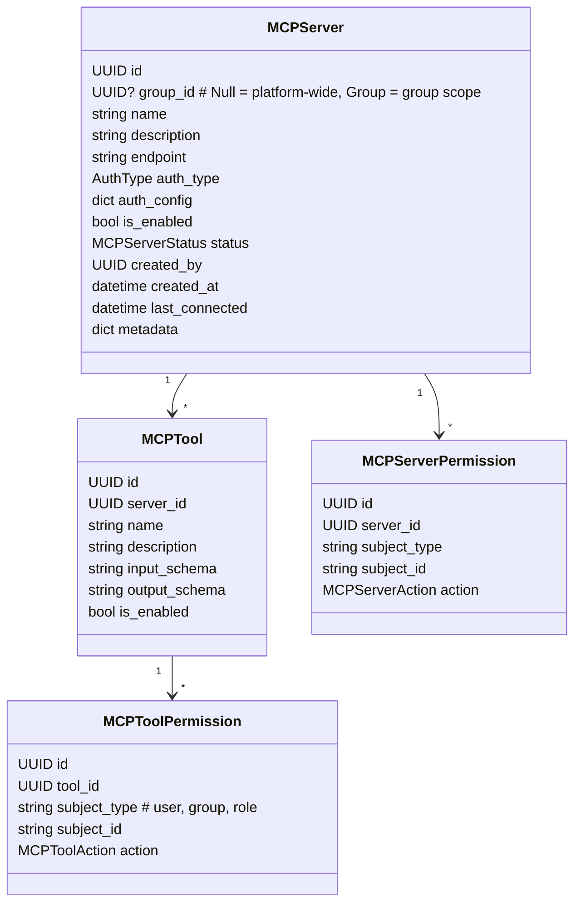
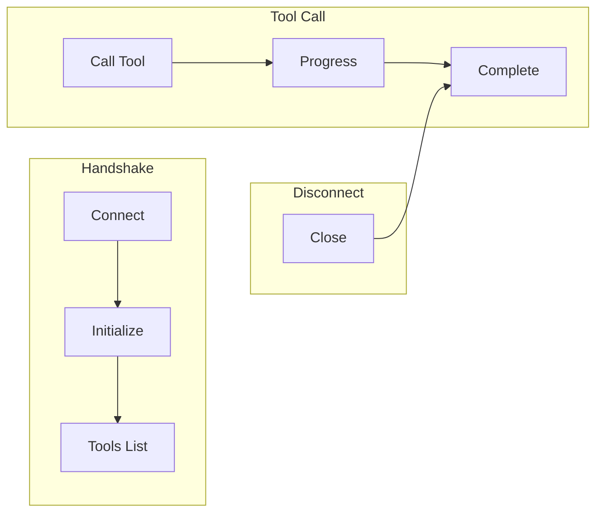
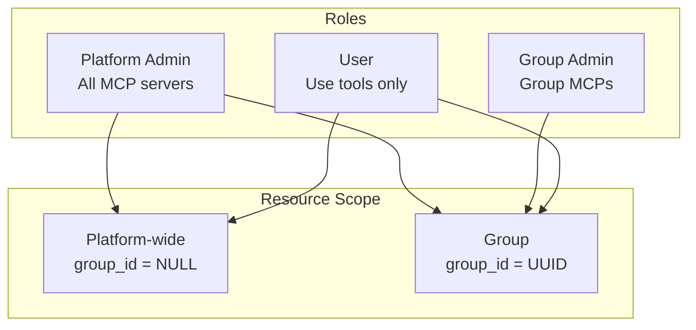
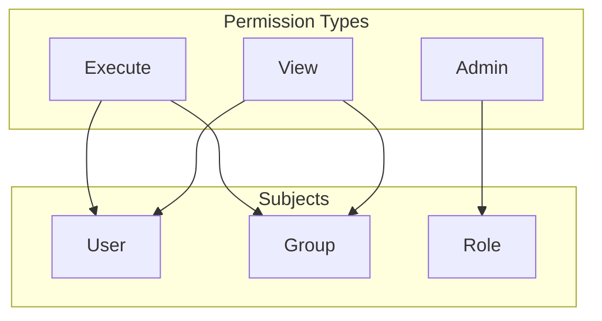
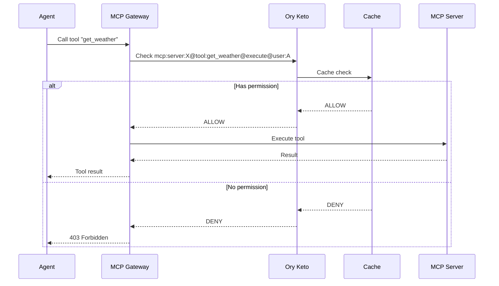
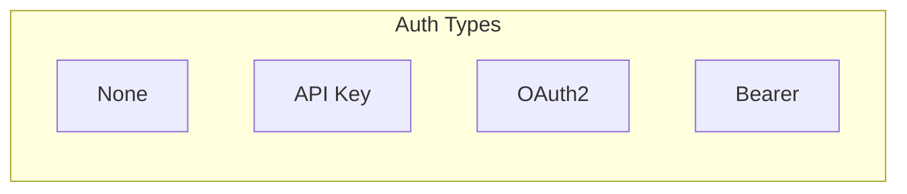
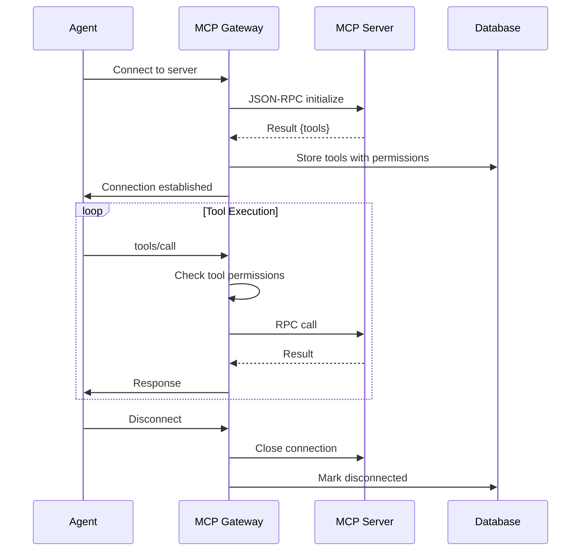
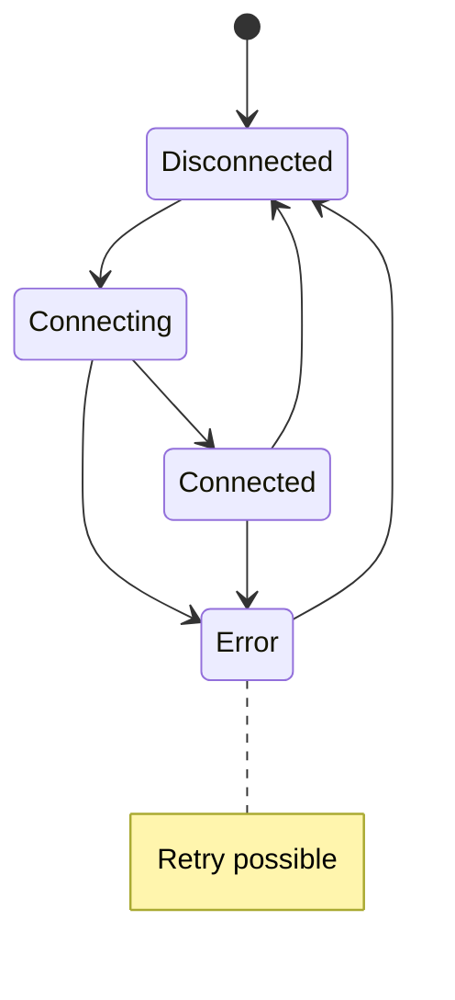

# Domain: MCP Gateway

## Overview

MCP Gateway domain - управление MCP серверами, tool registry и протокол execution с поддержкой tool-level permissions.

## Entities



## MCP Protocol



## Permission Model

### Roles & Scope



### Permission Matrix

| Role | Scope | Create | Read | Update | Delete | Execute Tools |
|------|-------|--------|------|--------|--------|---------------|
| Platform Admin | Platform-wide | ✓ | ✓ | ✓ | ✓ | ✓ |
| Platform Admin | Group | ✓ | ✓ | ✓ | ✓ | ✓ |
| Group Admin | Own Group | ✗ | ✓ | ✓ | ✗ | ✓ |
| User | Any | ✗ | Own | ✗ | ✗ | ✓* |

*With tool-level permission

### Tool-Level Permissions

Granular permissions per tool within a server:

```
# Examples
mcp:server:123@tool:get_weather@execute@user:alex
mcp:server:123@tool:search@execute@group:engineering
mcp:server:123@tool:*@admin@role:mcp_admin
```

| Action | Description |
|--------|-------------|
| `execute` | Execute the tool |
| `view` | See tool exists (list/read) |
| `admin` | Enable/disable tool, update config |



**Permission Matrix:**

| Action | Description |
|--------|-------------|
| `execute` | Execute the tool |
| `view` | See tool exists (list/read) |
| `admin` | Enable/disable tool, update config |

**Examples:**
```
mcp:server:123@tool:get_weather@execute@user:alex
mcp:server:123@tool:search@execute@group:engineering
mcp:server:123@tool:*@admin@role:mcp_admin
```

## Permission Check Flow



## Auth Types



## Connection Lifecycle



## API Reference

### REST Endpoints

#### Servers (Admin/Group Admin)

| Method | Endpoint | Description | Access |
|--------|----------|-------------|--------|
| GET | /api/mcp | List MCP servers | Platform/Group Admin |
| POST | /api/mcp | Register server | Platform Admin |
| GET | /api/mcp/{id} | Get server | Platform/Group Admin |
| PATCH | /api/mcp/{id} | Update server | Platform/Group Admin |
| DELETE | /api/mcp/{id} | Delete server | Platform Admin |
| POST | /api/mcp/{id}/test | Test connection | Platform/Group Admin |
| POST | /api/mcp/{id}/connect | Connect | Platform/Group Admin |
| POST | /api/mcp/{id}/disconnect | Disconnect | Platform/Group Admin |

#### Tools (Admin/Group Admin)

| Method | Endpoint | Description | Access |
|--------|----------|-------------|--------|
| GET | /api/mcp/{id}/tools | List tools | Platform/Group Admin |
| GET | /api/mcp/{id}/tools/{tool_id} | Get tool | Platform/Group Admin |
| PATCH | /api/mcp/{id}/tools/{tool_id} | Enable/disable | Platform/Group Admin |

#### Tool Permissions (Admin)

| Method | Endpoint | Description | Access |
|--------|----------|-------------|--------|
| GET | /api/mcp/{id}/tools/{tool_id}/permissions | List permissions | Platform/Group Admin |
| POST | /api/mcp/{id}/tools/{tool_id}/permissions | Add permission | Platform Admin |
| DELETE | /api/mcp/{id}/tools/{tool_id}/permissions/{perm_id} | Remove permission | Platform Admin |

#### Tool Execution (All authenticated)

| Method | Endpoint | Description | Access |
|--------|----------|-------------|--------|
| POST | /api/mcp/{id}/tools/{tool_name}/execute | Execute tool | User + tool permission |

## Server Status

