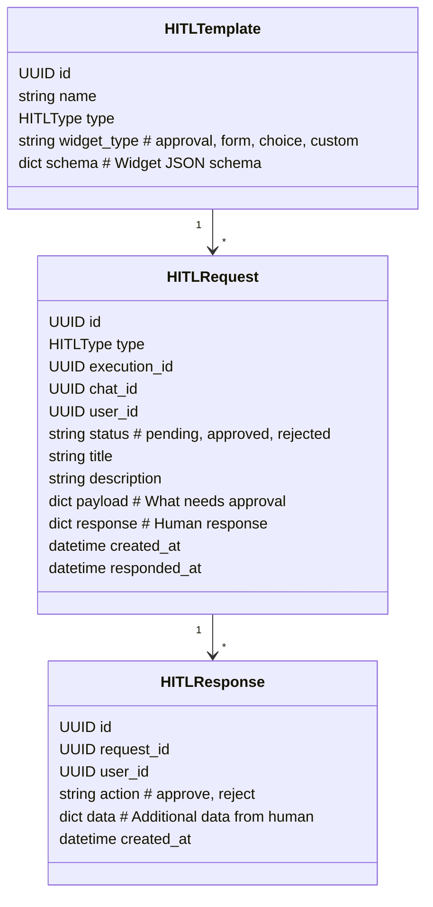
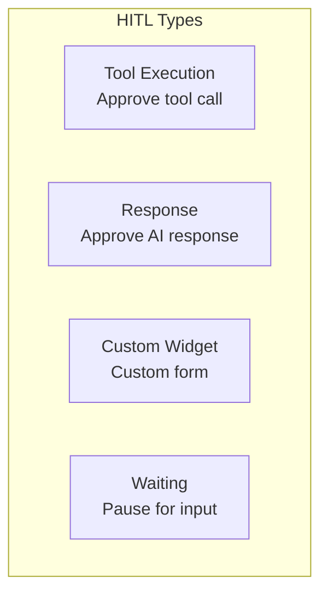
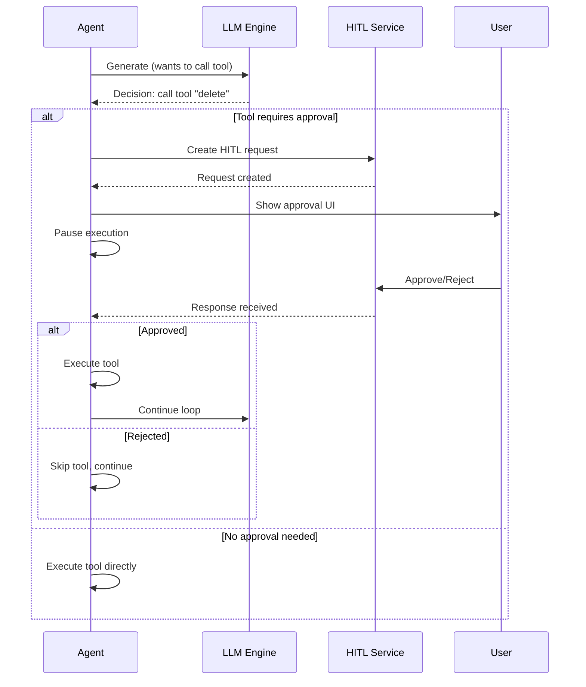
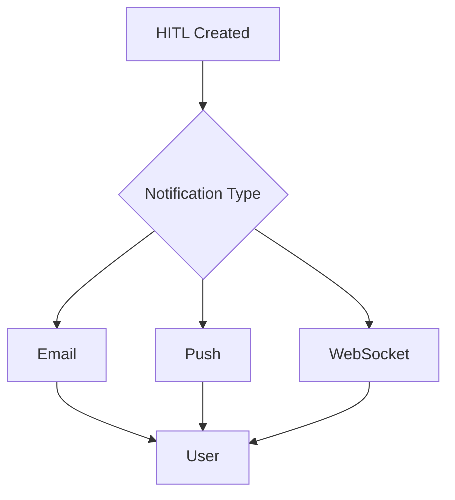

# Domain: HITL (Human-in-the-Loop)

## Overview

Human-in-the-Loop система для approval/rejection действий агентов и tool executions.

## Use Cases

1. **Tool Execution Approval** - Агент хочет выполнить опасный tool (удаление, отправка)
2. **Response Review** - AI сгенерировал ответ, человек должен одобрить
3. **Custom Widgets** - Кастомные формы для ввода данных человеком

## Entities



## HITL Types



## Chat Integration

### Message Payload Format

```json
{
  "content": "Should I delete the file?",
  "hitl": {
    "type": "tool_execution",
    "tool_name": "delete_file",
    "tool_args": { "path": "/data/important.txt" },
    "require_approval": true,
    "options": {
      "approve_label": "Delete",
      "reject_label": "Cancel",
      "show_preview": true
    }
  }
}
```

### With Custom Widget

```json
{
  "content": "Please confirm the order details",
  "hitl": {
    "type": "custom_widget",
    "widget": {
      "type": "form",
      "schema": {
        "type": "object",
        "properties": {
          "quantity": { "type": "integer", "minimum": 1 },
          "shipping_address": { "type": "string" },
          "confirm": { "type": "boolean" }
        },
        "required": ["quantity", "confirm"]
      }
    }
  }
}
```

### Approval/Rejection in Request

```json
{
  "content": "Send message to customer",
  "hitl": {
    "type": "response",
    "require_approval": true
  },
  "approvals": {
    "request_id_1": { "action": "approve" },
    "request_id_2": { "action": "reject", "reason": "Wrong recipient" }
  }
}
```

## Agentic Workflow Integration

### Separate Endpoints

| Endpoint | Method | Description |
|----------|--------|-------------|
| `/api/agents/{id}/executions/{exec_id}/hitl` | GET | List pending HITL requests |
| `/api/agents/{id}/executions/{exec_id}/hitl/{request_id}/respond` | POST | Respond to HITL |
| `/api/agents/{id}/executions/{exec_id}/pause` | POST | Pause execution for human input |
| `/api/agents/{id}/executions/{exec_id}/resume` | POST | Resume after human input |

### Agent Flow with HITL



## API Reference

### REST Endpoints

#### HITL Requests

| Method | Endpoint | Description |
|--------|----------|-------------|
| GET | /api/hitl | List my HITL requests |
| GET | /api/hitl/{id} | Get HITL request |
| POST | /api/hitl/{id}/respond | Respond to request |

#### Agent Executions

| Method | Endpoint | Description |
|--------|----------|-------------|
| GET | /api/agents/{id}/executions/{exec_id}/hitl | Execution HITL requests |
| POST | /api/agents/{id}/executions/{exec_id}/hitl/{request_id}/approve | Approve |
| POST | /api/agents/{id}/executions/{exec_id}/hitl/{request_id}/reject | Reject |
| POST | /api/agents/{id}/executions/{exec_id}/hitl/{request_id}/respond | Custom response |

#### Chat Messages

| Field | Type | Description |
|-------|------|-------------|
| `hitl` | object | HITL config |
| `hitl.type` | string | Type: tool_execution, response, custom_widget |
| `hitl.require_approval` | boolean | Requires human approval |
| `hitl.widget` | object | Custom widget schema |
| `approvals` | map | Map of request_id -> response |

## Widget Types

### Approval Widget

```json
{
  "type": "approval",
  "title": "Confirm Action",
  "description": "Are you sure?",
  "approve_label": "Yes, proceed",
  "reject_label": "No, cancel"
}
```

### Choice Widget

```json
{
  "type": "choice",
  "title": "Select Option",
  "options": [
    { "value": "a", "label": "Option A" },
    { "value": "b", "label": "Option B" }
  ],
  "multi": false
}
```

### Form Widget

```json
{
  "type": "form",
  "schema": {
    "type": "object",
    "properties": {
      "name": { "type": "string" },
      "email": { "type": "string", "format": "email" }
    }
  }
}
```

## Notification Flow

